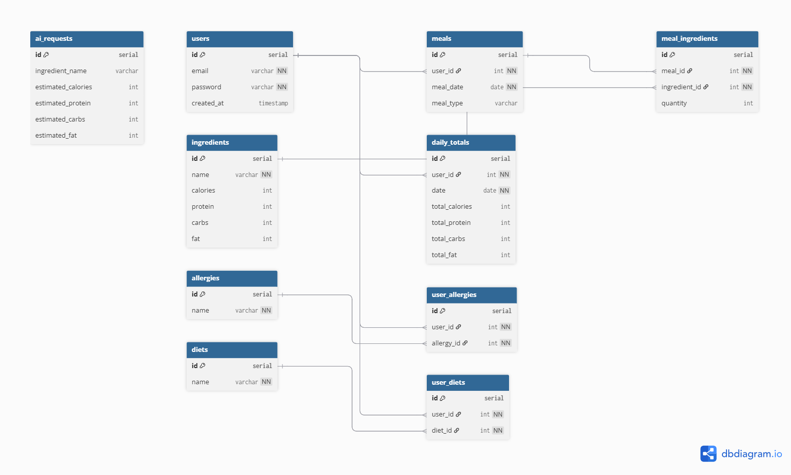

# Feastly

https://feastly-backend-j2xd.onrender.com

## Overview

Feastly is a full-stack web application focused on nutrition tracking and meal logging, designed to help users better understand their eating habits and improve their health.

Users can track daily meals, monitor nutrition, and view trends over time.

The goal is to make nutrition tracking simple, insightful, and personalized.

---

## Core Features (MVP)

### Nutrition Tracking (Primary Focus)

- Daily/Weekly meal logging
- Macro tracking _(calories, protein, carbs, fat)_
- Nutrient breakdown dashboard

### Meal Logging & Planning

- Track meals by category _(breakfast, lunch, dinner, snacks)_
- Calendar-based tracking
- View historical nutrition data

### Recipe Management (Core Feature)

- Create recipes manually
- Save and edit recipes
- View saved recipes
- Link recipes to meals

### User System

- Authentication _(register/login)_
- User preferences & health info
- Personalized dashboard

---

## Stretch Features (AI + Enhancements)

### AI Features (Secondary)

- Generate recipes based on available ingredients
- Suggest meals based on:
  - User goals
  - Allergies
  - Preferences
- “Inspo” feature for meal ideas

### Additional Enhancements

- Upload recipes from external sources
- Barcode scanner for food items
- Auto grocery list generator
- Social media recipe import
- Guest browsing _(view recipes without account)_

---

## Wireframes

Below is the initial UI wireframe showing the layout of the application along with the schema of the database:

  

- Dashboard with daily meals _(breakfast/lunch/dinner/snacks)_
- Account settings panel
- Recipe & ingredient management page
- AI recipe generator interface

  

- Users – Stores user accounts and authentication data
- Meals & Meal Ingredients – Tracks meals with linked ingredients (many-to-many)
- Ingredients – Contains nutritional data (calories, protein, carbs, fat)
- Daily Totals – Aggregates daily nutrition per user
- Allergies & Diets – Manages user preferences via join tables
- AI Requests – Stores AI-generated nutrition estimates

---

## Tech Stack

### Backend

- Node.js (Runtime Environment)
- Express.js (Server Framework)
- PostgreSQL (Database)
- JSON Web Tokens (Authentication)

---

## Architecture Overview

### Project Structure

feastly-backend/
├── api/ # Route handlers (API endpoints)
├── db/ # Database setup and queries
├── middleware/ # Custom Express middleware
├── utils/ # Utility/helper functions

---

## API Endpoints

### Users

| Method | Endpoint              | Description                      |
| ------ | --------------------- | -------------------------------- |
| POST   | `/api/users/register` | Create a new user account        |
| POST   | `/api/users/login`    | Authenticate user and return JWT |
| GET    | `/api/users/:id`      | Fetch user details by ID         |

### Meals

| Method | Endpoint         | Description           |
| ------ | ---------------- | --------------------- |
| GET    | `/api/meals`     | Fetch all meals       |
| POST   | `/api/meals`     | Create a new meal     |
| GET    | `/api/meals/:id` | Fetch a specific meal |
| PUT    | `/api/meals/:id` | Update a meal         |
| DELETE | `/api/meals/:id` | Delete a meal         |

### Ingredients

| Method | Endpoint               | Description                 |
| ------ | ---------------------- | --------------------------- |
| GET    | `/api/ingredients`     | Fetch all ingredients       |
| GET    | `/api/ingredients/:id` | Fetch a specific ingredient |
| POST   | `/api/ingredients`     | Create a new ingredient     |
| PUT    | `/api/ingredients/:id` | Update an ingredient        |
| DELETE | `/api/ingredients/:id` | Delete an ingredient        |

### Daily Totals

| Method | Endpoint                                   | Description                                |
| ------ | ------------------------------------------ | ------------------------------------------ |
| GET    | `/api/dailyTotals`                         | Fetch all daily nutrition totals           |
| GET    | `/api/dailyTotals/:id`                     | Fetch a specific daily total               |
| GET    | `/api/dailyTotals/user/:userId/date/:date` | Fetch totals for a user on a specific date |
| POST   | `/api/dailyTotals`                         | Create daily totals entry                  |
| PUT    | `/api/dailyTotals/:id`                     | Update daily totals                        |
| DELETE | `/api/dailyTotals/:id`                     | Delete daily totals                        |

### Saved Meals

| Method | Endpoint                  | Description                                  |
| ------ | ------------------------- | -------------------------------------------- |
| GET    | `/api/savedMeals`         | Fetch all saved meals for the logged-in user |
| GET    | `/api/savedMeals/:id`     | Fetch a specific saved meal                  |
| POST   | `/api/savedMeals`         | Create a new saved meal template             |
| PUT    | `/api/savedMeals/:id`     | Update a saved meal                          |
| DELETE | `/api/savedMeals/:id`     | Delete a saved meal                          |
| POST   | `/api/savedMeals/:id/use` | Convert a saved meal into a logged meal      |

### Meal Ingredients

| Method | Endpoint                   | Description                      |
| ------ | -------------------------- | -------------------------------- |
| GET    | `/api/mealIngredients`     | Fetch all meal ingredients       |
| GET    | `/api/mealIngredients/:id` | Fetch a specific meal ingredient |
| POST   | `/api/mealIngredients`     | Add an ingredient to a meal      |
| PUT    | `/api/mealIngredients/:id` | Update a meal ingredient         |
| DELETE | `/api/mealIngredients/:id` | Remove an ingredient from a meal |

### Allergies

| Method | Endpoint             | Description              |
| ------ | -------------------- | ------------------------ |
| GET    | `/api/allergies`     | Fetch all allergies      |
| GET    | `/api/allergies/:id` | Fetch a specific allergy |
| POST   | `/api/allergies`     | Create a new allergy     |
| PUT    | `/api/allergies/:id` | Update an allergy        |
| DELETE | `/api/allergies/:id` | Delete an allergy        |

### Diets

| Method | Endpoint         | Description           |
| ------ | ---------------- | --------------------- |
| GET    | `/api/diets`     | Fetch all diets       |
| GET    | `/api/diets/:id` | Fetch a specific diet |
| POST   | `/api/diets`     | Create a new diet     |
| PUT    | `/api/diets/:id` | Update a diet         |
| DELETE | `/api/diets/:id` | Delete a diet         |

---

## Authors

- **Mary Imevbore**
- **Albert Hunt**
- **Andrey Mikhalev**
- **Kayla Rampersaud**
