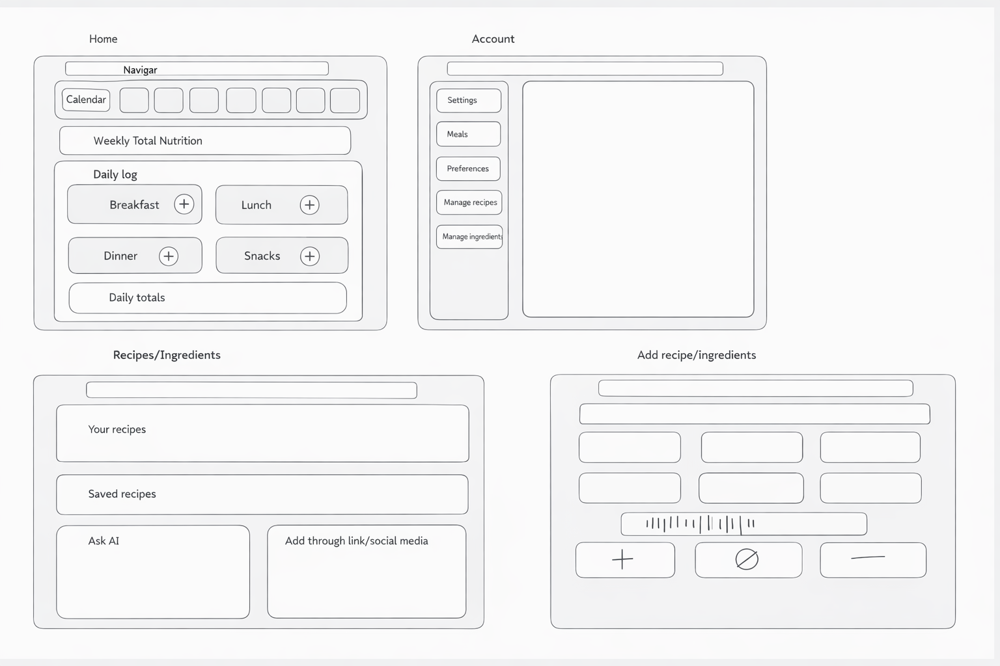
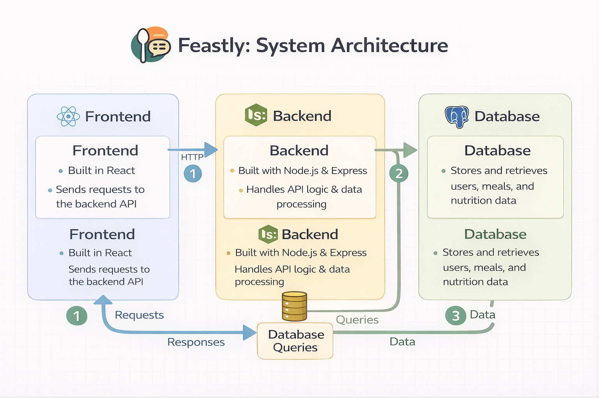

# 🍽️ Feastly

### Nutrition Tracker & Recipe Generator


---

## 📌 Overview

**Feastly** is a full-stack web application focused on **nutrition tracking and meal logging**, designed to help users better understand their eating habits and improve their health.

Users can track daily meals, monitor nutrition, and view trends over time.

👉 The goal is to make **nutrition tracking simple, insightful, and personalized**.

---

## ❗ Problem Statement

Many people struggle with:

- Tracking nutrition consistently
- Understanding their eating habits over time
- Identifying nutrient deficiencies
- Planning meals based on health goals

Existing apps are often:

- Overcomplicated
- Not tailored to individual needs
- Lacking meaningful insights

---

## 💡 What Makes Feastly Unique

- Tracker-first design (not dependent on AI)
- Combines nutrition tracking with recipe management
- Personalized insights based on user data
- AI used as an enhancement, not a requirement

---

## 🎯 Goals

- Provide a **simple and intuitive nutrition tracking system**
- Help users **log meals and monitor trends**
- Identify **nutrient gaps and patterns**
- Support **goal-based tracking** _(energy, weight, etc.)_

---

## ⭐ Core Features (MVP)

### 🥗 Nutrition Tracking (Primary Focus)

- Daily/Weekly meal logging
- Macro tracking _(calories, protein, carbs, fat)_
- Nutrient breakdown dashboard

### 🗓️ Meal Logging & Planning

- Track meals by category _(breakfast, lunch, dinner, snacks)_
- Calendar-based tracking
- View historical nutrition data

### 🍳 Recipe Management (Core Feature)

- Create recipes manually
- Save and edit recipes
- View saved recipes
- Link recipes to meals

### 🧑‍💻 User System

- Authentication _(register/login)_
- User preferences & health info
- Personalized dashboard

---

## 🚀 Stretch Features (AI + Enhancements)

### 🤖 AI Features (Secondary)

- Generate recipes based on available ingredients
- Suggest meals based on:
  - User goals
  - Allergies
  - Preferences
- “Inspo” feature for meal ideas

### 🍳 Additional Enhancements

- Save and manage recipes
- Upload recipes from external sources
- Barcode scanner for food items
- Auto grocery list generator
- Social media recipe import
- Guest browsing _(view recipes without account)_

---

## 🖼️ Wireframes

Below is the initial UI wireframe showing the layout of the application:

<p align="center">
  
</p>

- Dashboard with daily meals _(breakfast/lunch/dinner/snacks)_
- Account settings panel
- Recipe & ingredient management page
- AI recipe generator interface

---

## 🛠️ Tech Stack

### Frontend

- React (Vite)
- React Router
- Context API
- CSS / Modern UI Styling

### Backend

- Node.js
- Express.js
- REST API

### Database

- PostgreSQL
- SQL

### Tools & Libraries

- JWT Authentication
- bcrypt
- dotenv
- ESLint + Prettier
- Git & GitHub Projects

---

## 🏗️ Architecture Overview

### 📁 Project Structure

```bash
feastly-frontend/
  src/
    auth/
      AuthContext.jsx
    components/
      layout/
        Layout.jsx
        Navbar.jsx
      MealSection.jsx
      RequireLogin.jsx
    pages/
      Account.jsx
      DailyLogPage.jsx
      DailyTotal.jsx
      IngredientSearch.jsx
      Login.jsx
      Logout.jsx
      Register.jsx
      Error404.jsx
    App.jsx
    main.jsx

  assets/
    Wireframe.png

feastly-backend/
  api/
    dailyTotals.js
    ingredients.js
    mealIngredients.js
    meals.js
    users.js

  db/
    queries/
    client.js
    schema.sql

  middleware/
    getUserFromToken.js
    requireBody.js

  utils/
    jwt.js
```

---

## 🔗 API Endpoints

### Users

- POST /users/register → create user
- POST /users/login → authenticate user
- GET /users/:id → get user data

### Meals

- GET /meals → fetch all meals
- POST /meals → create a meal
- GET /meals/:id → get meal details

### Ingredients

- GET /ingredients → fetch ingredients
- GET /ingredients/:id → get ingredient details

### Daily Totals

- GET /dailyTotals → fetch nutrition totals

---

### 🧠 System Design

#### Frontend (React + Vite)

The frontend is built using React and Vite. It is responsible for rendering the user interface, handling routing, and managing client-side state.

- Pages represent major routes (login, dashboard, account, etc.)
- Components are reusable UI elements (meal sections, navbar, layout)
- AuthContext manages authentication state across the app
- Protected routes are handled using `RequireLogin`

#### Backend (Node.js + Express)

The backend is built with Express and provides RESTful API endpoints.

- Each resource (users, meals, ingredients, daily totals) has its own route file
- Middleware is used for authentication and validation
- Routes interact with the database through query functions

#### Database (PostgreSQL)

PostgreSQL stores all application data including:

- Users (authentication + profile)
- Meals (daily logs)
- Ingredients (nutrition data)
- MealIngredients (relationship between meals and ingredients)
- DailyTotals (aggregated nutrition tracking)

Relational structure enables accurate nutrition tracking and aggregation.

---

### 🔄 Data Flow

1. A user interacts with the React frontend (e.g., logs a meal).
2. The frontend sends a request to the Express backend API.
3. Middleware authenticates the user using JWT.
4. The backend processes the request and queries PostgreSQL.
5. The database returns the requested data.
6. The backend sends a response back to the frontend.
7. The frontend updates the UI (daily logs, totals, dashboard).

<p align="center">
  
</p>

---

## 👩‍💻 Authors

- **Mary Imevbore**
- **Albert Hunt**
- **Andrey Mikhalev**
- **Kayla Rampersaud**

---

## 📌 Project Status

🚧 **In Development (Capstone Project)**
This project is currently being built as part of a full-stack capstone.
